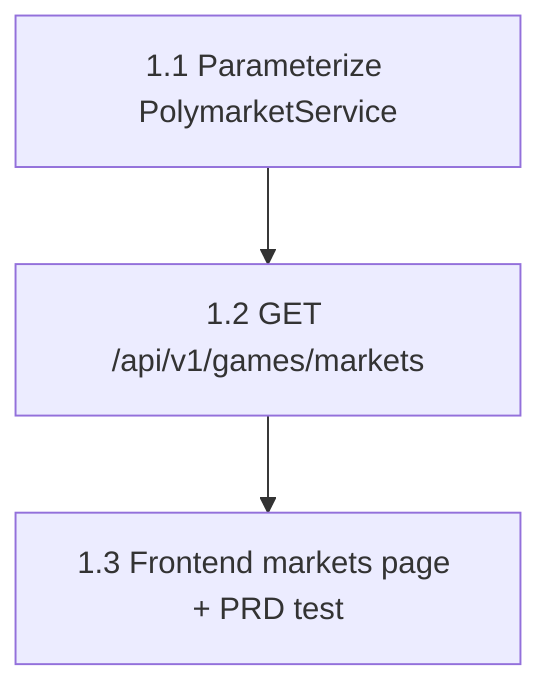

# Mainspec: polymarket-live-data

## Why

`PolymarketService` and `/games/today/markets` exist but nobody has proven
they carry real, live market data end-to-end, and the frontend doesn't show
any Polymarket data at all. It's NBA offseason, so NBA-tagged markets are
stale/resolved (prices settle to exactly 0/1). `odds.py` already solved this
exact problem for sportsbook lines by accepting a `sport` parameter so the
service can be pointed at WNBA (`basketball_wnba`), which has live markets
right now. This feature does the same for Polymarket: parameterize the tag,
add an endpoint that surfaces real market data independent of game-matching,
and render it in the frontend — proof the pipeline genuinely works.

## What (end state)

1. `PolymarketService.get_nba_markets(tag_slug: str = "nba")` accepts a tag
   parameter instead of hardcoding `"nba"`, mirroring
   `OddsService.get_nba_game_lines(sport: str = _NBA_SPORT)`.
2. A new `GET /api/v1/games/markets?tag_slug=...` endpoint returns raw
   Polymarket markets (a JSON list of `PolymarketMarket`-shaped objects) for
   the requested tag, with no dependency on today's NBA schedule or
   game-matching — so it still returns data when the schedule is empty.
3. A frontend page fetches that endpoint and renders each market's question
   and price, proving the data reaches the browser.
4. `./prds/polymarket-live-data/run-prd-test.sh` exits 0.

## Codebase context

- `backend/services/polymarket.py` — `PolymarketService.get_nba_markets()`
  (no params today, hardcodes `tag_slug="nba"` at line 96) fetches from
  Gamma `/events`, filters via `_is_relevant()` (real bid/ask spread OR high
  volume), normalizes via `_parse_market()`. Cache key is the flat string
  `"poly_nba_markets"` (line 90) — must become tag-aware or WNBA/NBA calls
  will collide in the shared `CacheDB`.
- `backend/services/odds.py` — the pattern to mirror exactly:
  `_WNBA_SPORT = "basketball_wnba"` module constant (line 409),
  `get_nba_game_lines(self, sport: str = _NBA_SPORT)` (line 438), cache key
  `f"odds_lines:{sport}"` (line 451) — already tag/sport-aware in the cache
  key, which `polymarket.py` is not yet.
- `backend/routers/games.py` — existing routes on `router = APIRouter(prefix="/games", ...)`
  mounted at `/api/v1` in `main.py`. `_get_poly_service()` dependency
  factory already exists (line ~35). New route follows the same
  `Depends(_get_poly_service)` pattern used by `/today/markets`.
- `backend/models/schemas.py` — `PolymarketMarket` (line 161) is the exact
  shape `_parse_market()` produces; reuse it as-is, don't add fields.
  `NBAMarketsResponse` (line 178, wraps `markets`/`count`/`generated_at`)
  exists but is **not** what this endpoint returns — see Slice 1.2, the PRD
  test expects a bare JSON list.
- `backend/config.py` — `Settings` / `get_settings()`. No new setting is
  strictly required (tag_slug arrives as a query param), but if a default
  tag needs to live somewhere other than a literal, it goes through
  `Settings`, not a bare module constant duplicated across files.
- `backend/main.py` — `SecurityHeadersMiddleware` and the `Limiter` already
  wrap every route via `app.add_middleware` / `app.state.limiter`; the new
  route gets these for free by living in `routers/games.py`.
- `frontend/src/pages/Games.jsx`, `Props.jsx` — the established page
  pattern: `useEffect` + `client.get(...)` + `loading`/`error`/data state,
  Tailwind card list. New page follows this shape.
- `frontend/src/api/client.js` — shared `axios` instance, `baseURL` from
  `VITE_API_URL`, error interceptor extracts `error.response.data.detail`.
- `frontend/src/App.jsx` / `Navbar.jsx` — routes and nav links are flat
  arrays; adding a page means one `<Route>` and one nav link entry.
- Expert memory: [[pattern-dont-silently-fix-scaffolds]] — `_WNBA_SPORT` in
  `odds.py` is intentional live-data scaffolding, not leftover test code;
  the same posture applies to whatever WNBA constant this feature adds to
  `polymarket.py`. [[decision-predictor-ml-integration]] — `edge_engine.py`'s
  `model_prob = 0.5` placeholder and `find_prop_edges` stub are explicitly
  out of scope; do not touch them even though this feature adds a sibling
  endpoint in the same router file.

## Out of scope (from PRD)

- No sport-selector UI, no config-driven sport list, no per-sport alias
  tables.
- No automatic runtime fallback in existing routes (`/today/markets` keeps
  hardcoding `tag_slug="nba"`).
- No ML/predictor work (`edge_engine.py` placeholder stays untouched).
- No game-matching for non-NBA sports — new endpoint returns raw markets.
- No browser/visual verification — build success + static grep checks only.
- No new dependencies (frontend or backend).

## Slice Dependency Map

| Slice | Depends On | Blocks |
|-------|-----------|--------|
| 1.1 — Parameterize PolymarketService | — | 1.2 |
| 1.2 — `GET /api/v1/games/markets` endpoint | 1.1 | 1.3 |
| 1.3 — Frontend markets page + PRD test | 1.2 | — |

