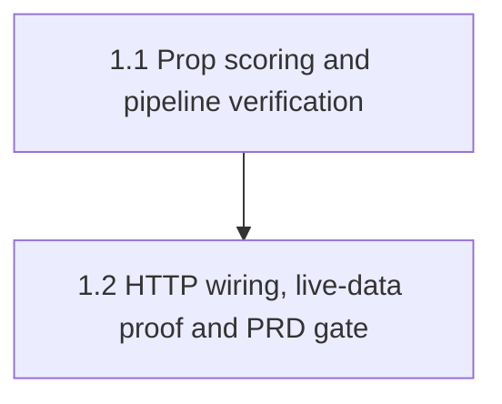

# Mainspec: prop-edge-pipeline

## Why

`EdgeEngine.find_game_edges()` gives the developer a proof-of-wiring for
game-level +EV scanning: fetch today's slate → score each event → filter by
`_MIN_EDGE_THRESHOLD` → sort by edge descending. Its prop-level sibling,
`find_prop_edges()`, was a stub returning `[]` unconditionally — no fetch, no
scoring, no filter. `GET /api/v1/props/edges` therefore always returned an
empty, meaningless response.

This feature builds the same fetch → score → filter → sort pipeline for
player props, using the `model_prob = 0.5` placeholder
(`decision-predictor-ml-integration`) since real ML prediction stays
deferred. The point is proving the prop pipeline is wired correctly
end-to-end — same class of proof the game-edge path already has.

## Important — codebase reality check before planning slices

Research for this mainspec found that **the implementation already exists**
in the working tree, on this branch:

- `backend/services/edge_engine.py`: `_score_prop_edge()` and
  `find_prop_edges()` are fully implemented (no longer stubs), using
  `OddsService.get_nba_game_lines(sport=...)` /
  `get_nba_player_props(game_id, sport=...)` — the real method names, not
  `find_game_edges`'s broken `get_game_odds()` / `decimal_to_implied_prob()`
  calls.
- `backend/routers/props.py`: `GET /props/edges` already calls
  `engine.find_prop_edges()` and wraps the result in `EdgeListResponse`;
  mounted at `/api/v1/props/edges` via `main.py`.
- Running `./prds/prop-edge-pipeline/run-prd-test.sh` **passes end-to-end
  today** (fixture scoring math, fixture pipeline wiring, live WNBA data,
  and the HTTP endpoint all check out).

This is unusual — normally spec-planning precedes implementation. It
happened here because the code landed in the same commit as the PRD
(`b452134`). It does not change the contract of this skill (mainspec +
slices + PRD-test-gated final slice are still required), but it changes
**what the slices should ask an implementing agent to do**: not "write
`find_prop_edges` from scratch," but "verify the existing implementation
against every clause of the PRD's definition of done, harden any gap found,
and lock in the passing state." Per
[[pattern-dont-silently-fix-scaffolds]], an implementing agent must not
"clean up" or rewrite code that already satisfies the spec just because it
looks like an easy rewrite — verify first, change only what's actually
wrong.

The one placeholder that remains **intentionally untouched** going forward:
`model_prob = 0.5` in both `_score_game_edge` and `_score_prop_edge`, and no
`NBAPredictor` call anywhere in prop scoring. That constraint is unchanged
by this feature landing — see `decision-predictor-ml-integration`'s "Until
fulfilled" clause. This mainspec's job is prop wiring, not model wiring.

## User story

As the developer, I can call `find_prop_edges()` (directly or via
`GET /api/v1/props/edges`) and get back real player-prop opportunities
scored against live sportsbook lines, so I know the prop pipeline is wired
correctly end-to-end — not just code that type-checks.

## What exists today (verified against the actual code, not just specs)

**`backend/services/edge_engine.py`**
- `_MIN_EDGE_THRESHOLD = 0.02`, `_WNBA_SPORT = "basketball_wnba"` (module
  constants, shared by game and prop paths).
- `find_game_edges()` / `_score_game_edge()` — the existing pattern this
  feature mirrors: try/except per fetch, threshold filter, descending sort
  by `best_edge`. Note: `_score_game_edge` calls
  `OddsService.get_game_odds()` / `decimal_to_implied_prob()`, **neither of
  which exist on `OddsService`** — a pre-existing, unrelated bug, explicitly
  out of scope (see PRD's "Out of scope").
- `find_prop_edges(player_id: Optional[str] = None)` — fetches
  `get_nba_game_lines(sport=_WNBA_SPORT)`, then per game
  `get_nba_player_props(game["game_id"], sport=_WNBA_SPORT)`, applies the
  case-insensitive `player_name` filter, scores each prop via
  `_score_prop_edge`, keeps `is_positive_ev`, sorts descending by
  `best_edge`.
- `_score_prop_edge(prop: dict)` — builds one `MarketPrice` from the prop's
  `bookmaker`/`over_prob`/`over_american`, sets `model_prob = 0.5`,
  `best_edge = model_prob - over_prob`, `kelly_fraction = max(0.0, edge /
  (1 - over_prob))`, `is_positive_ev = edge_value >= _MIN_EDGE_THRESHOLD`.

**`backend/models/schemas.py`** — `EdgeScore`, `EdgeListResponse`,
`MarketPrice`, `PropOdds` already have every field the prop path needs
(`event_type`, `model_probability`, `best_edge`, `best_source`,
`kelly_fraction`, `is_positive_ev`). No schema changes required.

**`backend/routers/props.py`** — `GET /edges` (→ `/api/v1/props/edges`) and
`GET /{player_id}/edges` both call into `EdgeEngine`, wrap results in
`EdgeListResponse`. No inline dicts cross the router boundary.

**`backend/main.py:78-79`** — both routers mounted under `/api/v1`.

## Slices

Two slices, sequential (the second depends on the first holding). Both are
verification-and-harden slices against real code, not greenfield builds.

### 1.1 — Prop scoring & pipeline verification
Audit `_score_prop_edge` and `find_prop_edges` line-by-line against every
clause of the PRD's definition of done. Confirm (don't assume) the scoring
math, the real `OddsService` method names, the try/except-per-fetch shape,
the threshold filter, the descending sort, and the case-insensitive
`player_name` filter. Fix anything that's actually wrong; leave anything
that's already correct alone.

### 1.2 — HTTP wiring, live-data proof & PRD gate
Confirm `GET /api/v1/props/edges` (and the `player_id`-scoped variant) are
reachable, return a well-formed `EdgeListResponse`, and that
`find_prop_edges()` completes without error against live WNBA data (proving
the wiring, independent of whether any prop clears the threshold today).
Run `./prds/prop-edge-pipeline/run-prd-test.sh` and make it exit 0 — this is
the feature's definition of done.

## Forward-looking requirements

- Nothing in this feature is expected to be extended by a near-future
  slice — the PRD explicitly scopes out ML integration, Polymarket prop
  matching, real player-ID resolution, and frontend work (see PRD "Out of
  scope"). Do not build hooks for any of these.
- If `find_game_edges`'s pre-existing `get_game_odds()` /
  `decimal_to_implied_prob()` bug is ever fixed in a later PRD, that work
  should not touch `find_prop_edges`/`_score_prop_edge` — the two paths are
  siblings, not shared implementation, by design.

## Slice Dependency Map

| Slice | Depends On | Blocks |
|-------|-----------|--------|
| 1.1 — Prop scoring & pipeline verification | — | 1.2 |
| 1.2 — HTTP wiring, live-data proof & PRD gate | 1.1 | — |

