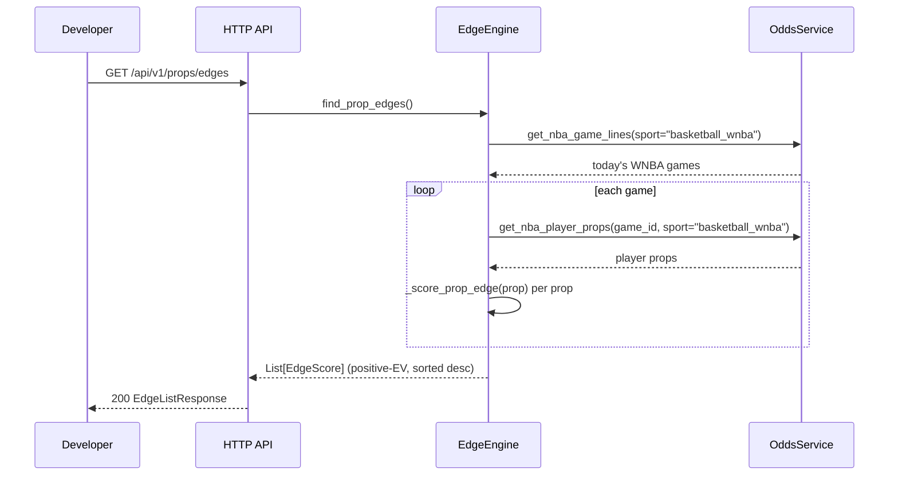

# Slice 1.2 — HTTP wiring, live-data proof & PRD gate

## Objective

Verify the prop-edge pipeline is reachable end-to-end — live `OddsService`
calls complete without error, and `GET /api/v1/props/edges` returns a
well-formed `EdgeListResponse` — then run the PRD test runner to gate
completion of the whole feature. Depends on Slice 1.1's scoring/pipeline
logic being correct; this slice does not re-verify the scoring math, only
the wiring around it.

## User story

As the developer, I can call `GET /api/v1/props/edges` and get a 200 with
real player-prop opportunities scored against live sportsbook lines — proof
the prop pipeline is wired correctly end-to-end, the same proof-of-wiring
the game-edge path already has.

## What to verify

**Live-data wiring** (`backend/services/edge_engine.py`,
`backend/services/odds.py`)

- `OddsService.get_nba_game_lines(sport="basketball_wnba")` returns live
  games today (this project's in-season stand-in for NBA odds during the
  offseason — see `_WNBA_SPORT` in `odds.py`). If this returns empty, that's
  a live-data/API-key problem, not a code problem — don't "fix" it by
  changing the sport constant.
- `find_prop_edges()` called with no live-data mocking completes without
  raising `AttributeError` (which would indicate a call to a
  nonexistent `OddsService` method) and returns a `list` of `EdgeScore`
  objects, each with `event_type == "prop"`.

**HTTP wiring** (`backend/routers/props.py`, `backend/main.py`)

- `GET /api/v1/props/edges` is mounted (via `main.py:79`,
  `props.router` prefix `/props` + app-level `/api/v1` prefix) and returns
  HTTP 200.
- Response body deserializes as `EdgeListResponse` — has `edges` (a list),
  `generated_at`, `total_opportunities`.
- No inline dicts cross the router boundary — `list_prop_edges()` in
  `props.py` returns the `EdgeListResponse` Pydantic model built from
  `EdgeEngine.find_prop_edges()`'s output directly, not a hand-built dict.

**DO ✅ — trust the router's existing dependency-injection shape**
```python
# backend/routers/props.py — already the pattern:
async def list_prop_edges(
    engine: EdgeEngine = Depends(_get_edge_engine),
) -> EdgeListResponse:
    edges = await engine.find_prop_edges()
    return EdgeListResponse(
        edges=edges, generated_at=datetime.utcnow(), total_opportunities=len(edges),
    )
```

**DON'T ❌ — bypass the engine or hand-roll the response**
```python
# Don't do ad-hoc dict construction or call OddsService directly from the router:
async def list_prop_edges(odds: OddsService = Depends(_get_odds_service)):
    return {"edges": odds.get_nba_player_props(...), "count": ...}  # wrong shape, no scoring
```

## Sequence



## Success Criteria

**This slice's job is to make the full PRD test pass — not just the parts
covered above.** Run:

```
./prds/prop-edge-pipeline/run-prd-test.sh
```

It must exit 0. This single command re-verifies Slice 1.1's scoring/pipeline
checks, the live-WNBA-data wiring, and the HTTP endpoint contract described
in this slice, in one pass — treat it as the authoritative gate, not the
descriptions above (which are context, not a spec of the test's internals).

Do not modify `prds/prop-edge-pipeline/run-prd-test.sh` to make it pass —
if it fails, the fix belongs in `backend/`, not in the test.
